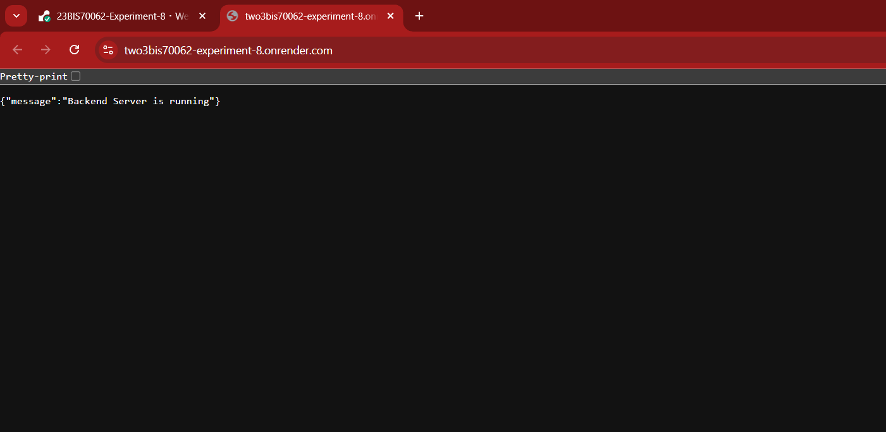
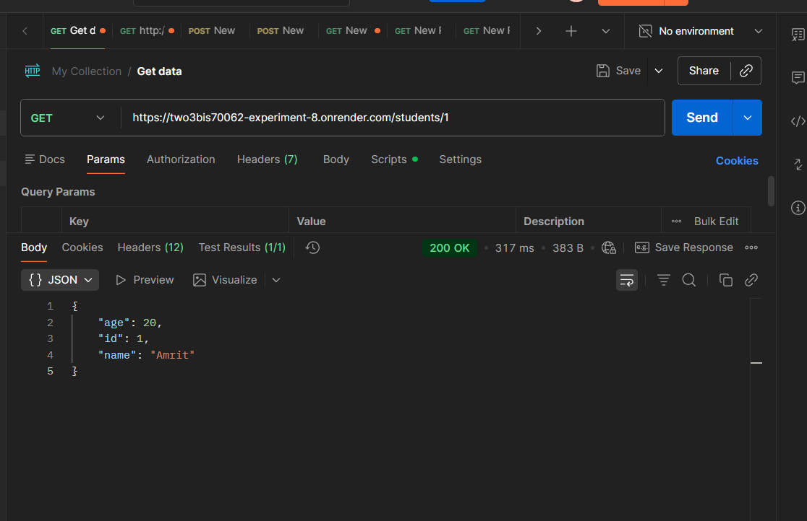
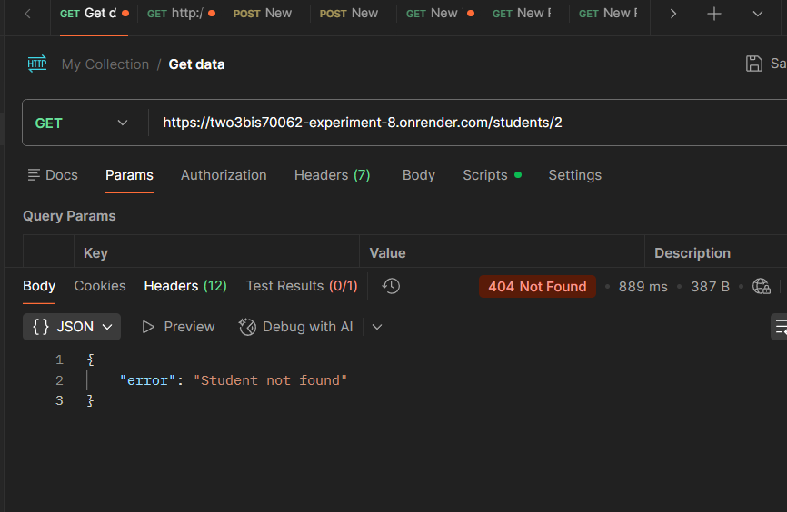
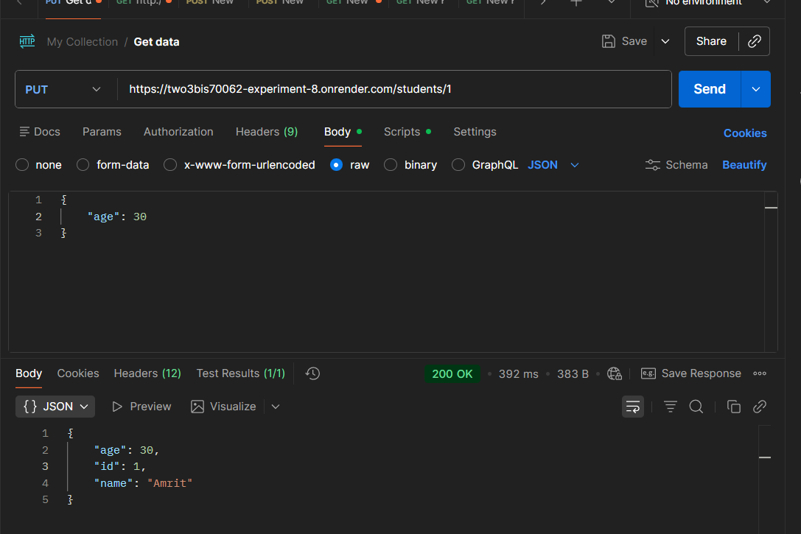
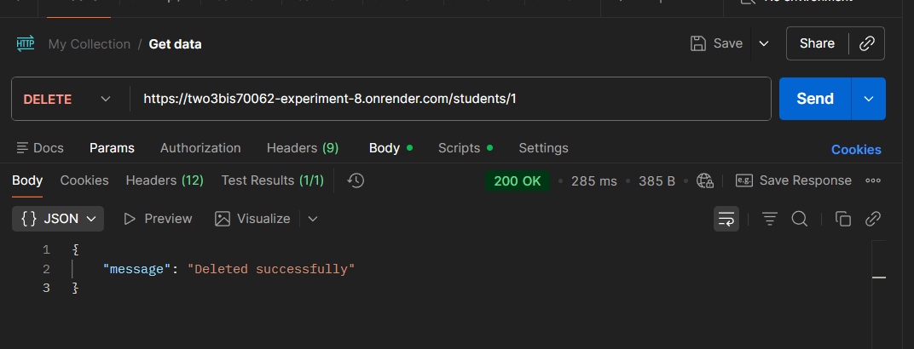

## Experiment No. 8 - Develop RESTful APIs using Backend Framework (Flask)

### Submitted By

- Name: Taranpreet Singh Mander
- UID: 23BIS70119

### Project Structure

```bash
Experiment_8/
├── routes/
│   └── student_routes.py
├── exp8/
│   ├── Include/
│   ├── Lib/
│   └── Scripts/
├── requirements.txt
├── app.py
├── run.py
└── README.md
```

### Technologies Used

- Python
- Flask
- REST API
- Postman
- Render (Cloud Deployment)
- Virtual Environment (venv)

### Deployment Base URL --> Render service: `taranpreet-singh-mander-exp8`

After creating the service in Render, your live URL will be available in the dashboard.

## STEPS & SCREENSHOTS

### 1. Server Running


Flask development server successfully started.

### 2. CREATE Student (POST)



### 3. READ ALL Students (GET)



### 4. READ ONE Student that doesn't exist in the DB

### GET Student ID = 2



### 5. UPDATE Student (PUT)



### 6. DELETE Student data



## API Endpoints Summary

| Method | Endpoint       | Description        |
| ------ | -------------- | ------------------ |
| POST   | /students      | Create new student |
| GET    | /students      | Get all students   |
| GET    | /students/<id> | Get student by ID  |
| PUT    | /students/<id> | Update student     |
| DELETE | /students/<id> | Delete student     |

## Learning Outcome

- Gained foundational knowledge of backend development technologies.
- Developed the ability to create and manage Python virtual environments using venv.
- Acquired practical experience with the Flask framework in Python.
- Understood the principles and structure of RESTful APIs.
- Implemented routing mechanisms within Flask applications.
