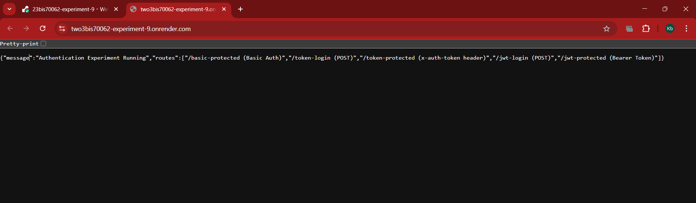
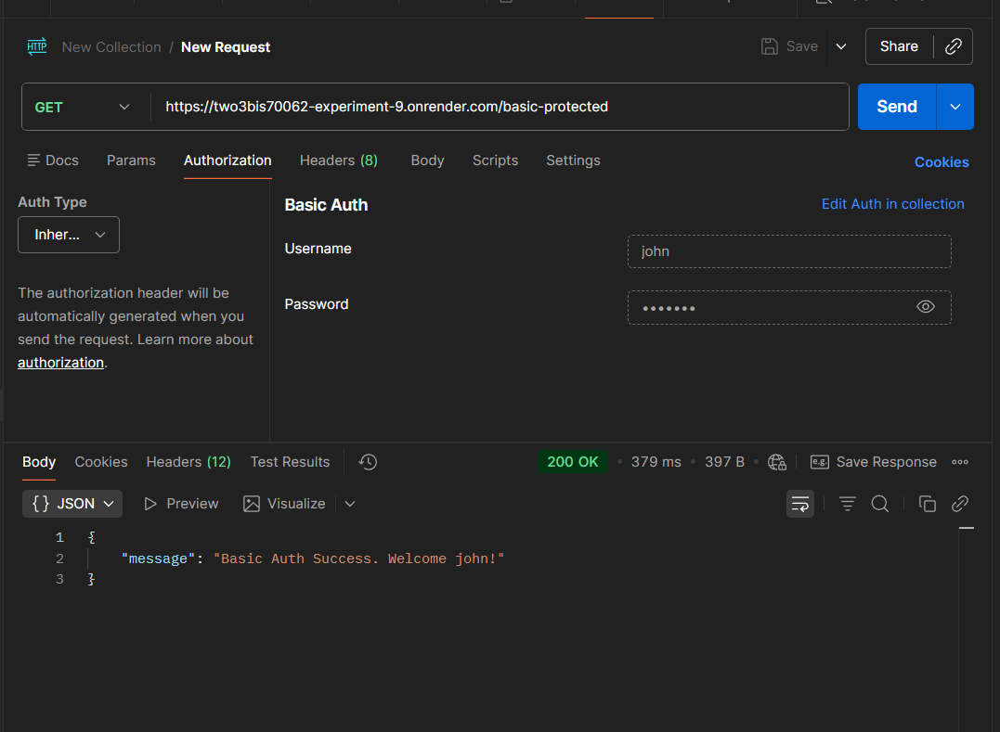
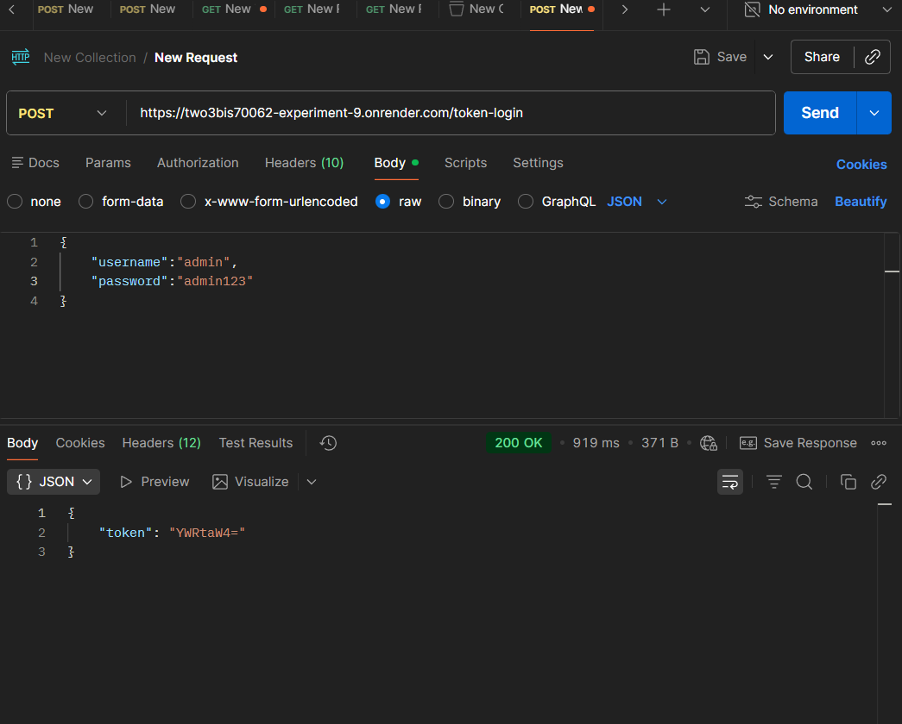
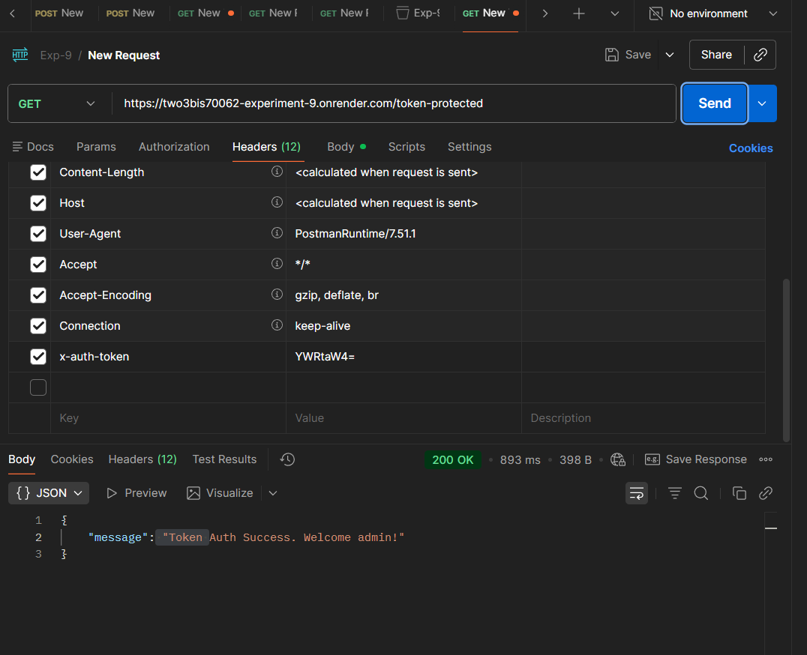
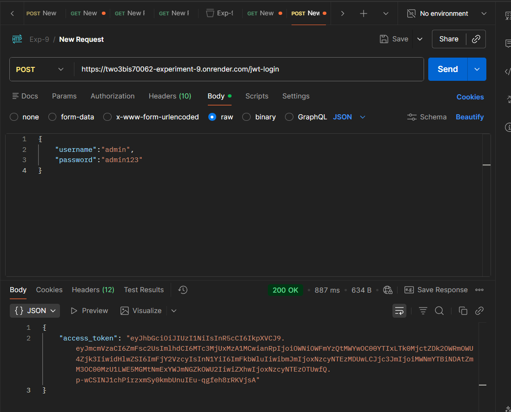
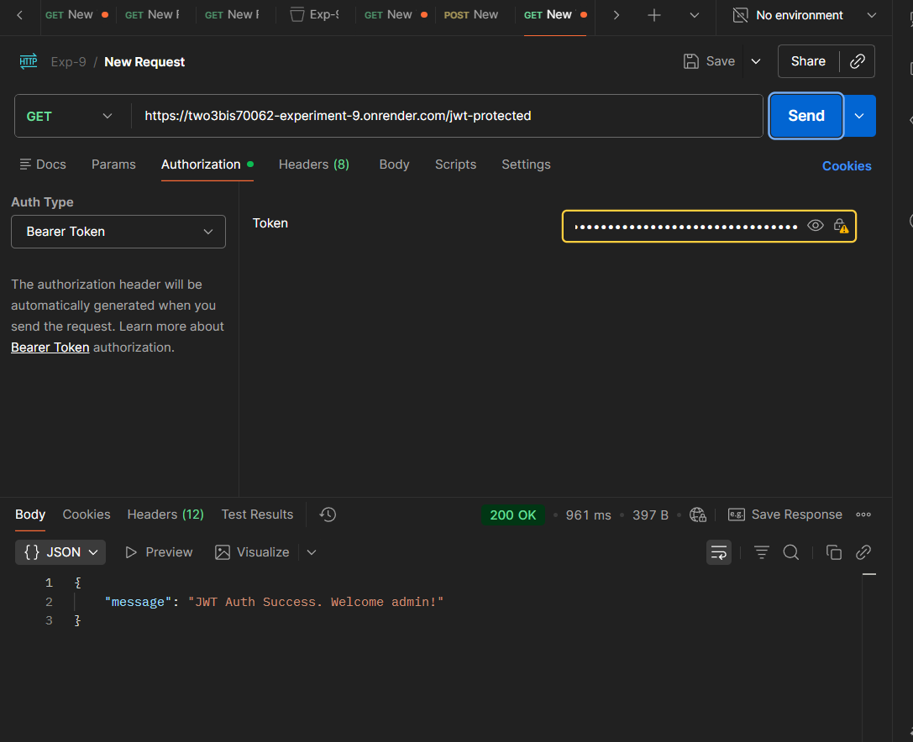

# Experiment 9 - Authentication Using JWT

**Student Name:** Taranpreet Singh  
**UID:** 23bis70119

This project demonstrates three authentication approaches in Flask: Basic Auth, a simple Base64 token flow, and JWT-based authentication. It is prepared for GitHub upload and Render deployment.

## Highlights

- Basic authentication with `Authorization`
- Base64 token flow with `x-auth-token`
- JWT login and protected route with Bearer tokens
- Render-ready Gunicorn startup

## Project Structure

```bash
Exp9_FSDII/
├── app.py
├── Procfile
├── README.md
├── requirements.txt
├── screenshots/
│   ├── 1.png
│   ├── 2.png
│   ├── 3.png
│   ├── 4.png
│   ├── 5.png
│   └── 6.png
└── .gitignore
```

## API Endpoints

| Method | Endpoint | Description |
| --- | --- | --- |
| GET | / | Shows project info and available routes |
| GET | /basic-protected | Basic authentication protected route |
| POST | /token-login | Generates a simple Base64 token |
| GET | /token-protected | Accesses route with `x-auth-token` |
| POST | /jwt-login | Generates a JWT access token |
| GET | /jwt-protected | Accesses route with a JWT Bearer token |

## Authentication Methods

| Method | Header Used | Stateless? | Security Level |
| --- | --- | --- | --- |
| Basic Auth | Authorization | Yes | Weak |
| Base64 Token | x-auth-token | Yes | Very Weak |
| JWT | Authorization: Bearer | Yes | Strong |

## Run Locally

1. Activate the virtual environment.
2. Install dependencies with `pip install -r requirements.txt`.
3. Start the app with `python app.py`.

## Deploy On Render

1. Push this repository to GitHub.
2. Create a new Render Web Service and connect the repository.
3. Use the following settings:
	- Build Command: `pip install -r requirements.txt`
	- Start Command: `gunicorn app:app`
4. Deploy. Render will provide the `PORT` environment variable automatically.

## Screenshots

### Server Start



### Basic Auth



### Token Login



### Token Protected Route



### JWT Login



### JWT Verification



## Learning Outcome

- Learned how authentication works in Flask.
- Learned to use virtual environments for Python projects.
- Learned the difference between Basic Auth, token-based auth, and JWT.
- Learned how to prepare a project for GitHub and Render.

## Notes For GitHub Upload

- Keep the `screenshots/` folder in the repository so the README renders correctly.
- Do not commit the virtual environment folder; it is ignored by `.gitignore`.
