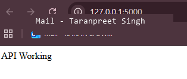
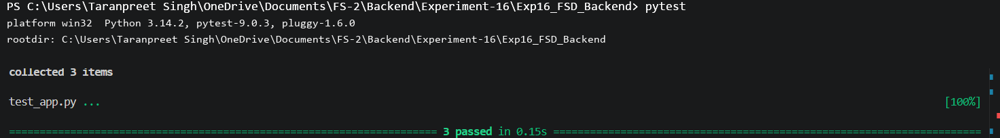
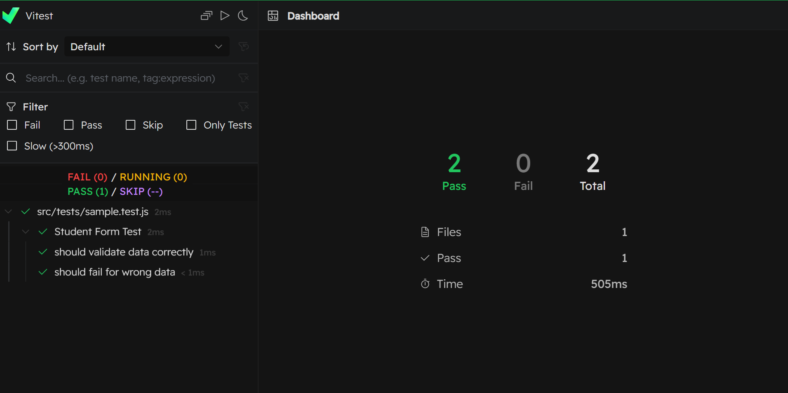
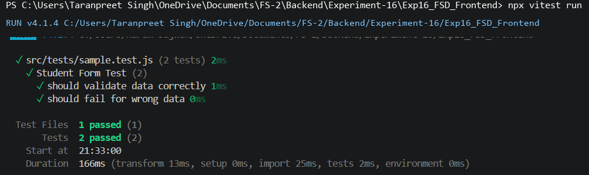

# 🚀 Full Stack Unit Testing Project (FSD-II)

### Experiment No. 16: Perform Unit Testing for Frontend & Backend Modules

---

## 🎯 Aim

To implement unit testing for backend APIs (Flask) and frontend modules using automated testing frameworks.

---

## ⚙️ Technologies Used

### Backend

- Python
- Flask
- Pytest
- Pytest-Cov

### Frontend

- React (Vite)
- Vitest
- React Testing Library
- Material UI

---

# 🧠 Theory

### 🔹 Importance of Testing

- Improves reliability
- Prevents regressions
- Ensures correctness

### 🔹 Types of Testing

- Unit Testing
- Integration Testing
- System Testing
- Acceptance Testing

---

# 🧪 Backend Testing (Flask + Pytest)

## ✔️ Implementation
- Created REST API using Flask
- Tested endpoints using pytest
- Used Flask test client for API testing

## 🧪 Example Test

```python
import pytest
from app import app

@pytest.fixture
def client():
    app.config['TESTING'] = True
    return app.test_client()

def test_home(client):
    response = client.get('/')
    assert response.status_code == 200

def test_add_student(client):
    response = client.post('/students', json={
      "name": "Taranpreet Singh",
        "age": 21
    })
    assert response.status_code == 201
```

## ▶️ Run Backend Tests

```bash
pytest -v
```
---

# ⚛️ Frontend Testing (Vitest + React Testing Library)

## Implementation

- Created test cases using Vitest  
- Verified logic using assertions  

---

## Frontend Test Code

```javascript
import { describe, it, expect } from 'vitest'

describe('Basic Test Suite', () => {

  it('checks addition', () => {
    expect(2 + 3).toBe(5)
  })

  it('validates string', () => {
    const name = "Taranpreet Singh"
    expect(name).toBe("Taranpreet Singh")
  })

  it('checks number condition', () => {
    const age = 21
    expect(age).toBeGreaterThan(18)
  })

})
```

## 🔧 Tools Used

- Vitest → test runner
- React Testing Library → DOM testing
- jsdom → browser simulation

## ▶️ Run Frontend Tests

```bash
npm install
npm run test
```

OR:

```bash
npx vitest
```

---

# 📸 Screenshots

### Backend Server Test



### Backend Test



### Frontend Tests



### Frontend Report



---

# 📚 Learning Outcomes

- Learned backend unit testing using Flask and Pytest
- Understood API testing using test client
- Learned frontend testing using Vitest
- Understood DOM-based testing using React Testing Library
- Gained experience debugging real-world issues
- Learned importance of test coverage

---

# 👨‍💻 Author

Taranpreet Singh
23BIS70119